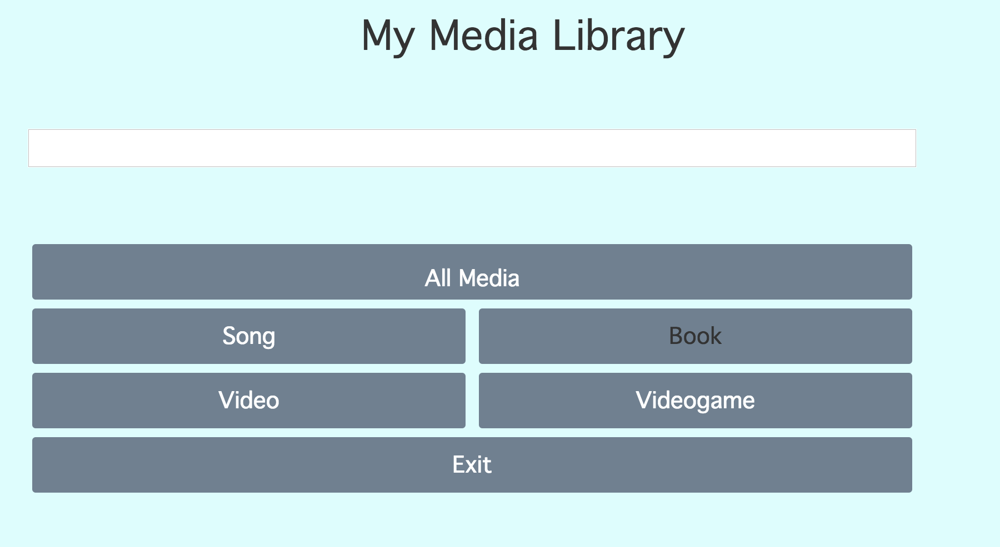

# JPerL4

###Personal media library with javascript

This project is patterned after the team project CS1JPerL3 which is a Java program.  This project's goal it to 
make a project very similar but use Javascript, Node, Bootstrap, express and postgres database.
This is an example of a webpage:

